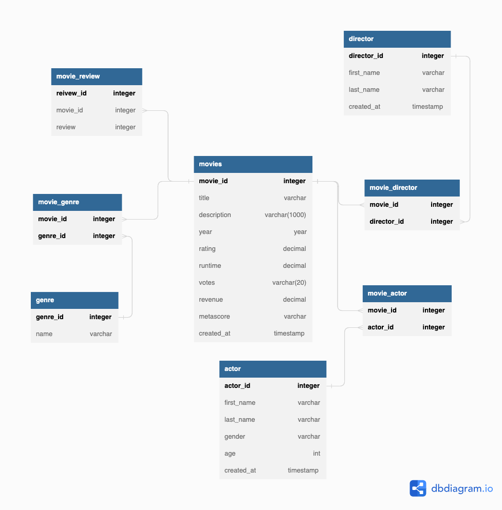

# Movies PostgreSQL
*Author: Jeet Soni*

*Date: 07/04/2022*

 ----

 ### **Description**

 Honestly, Boredom and curiousity took over me. I got a little bored doing the mySQL stuff again and again. I was curious to how other databases work and are the scripts different from each other? So I picked up PostgreSQL and it was really fun. I learned a lot and realized that databases are not that different from each other. I worked with the movies excel file chopped it up using normilization and built the database. 

 ### **Data**

 ### **Data**
| id | title | genre | description | director | actors | year | runtime   | rating  | votes | revenue | metascore | 
|---|---|---|---|---|---|---|---|---|---|---|---|
| 1 | Guardian of the galaxy | Action,Adventure,Sci-Fi  | A group of intergalactic criminals are forced to work together to stop a fanatical warrior from taking control of the universe  |James Gunn |Chris Pratt, Vin Diesel, Bradley Cooper, Zoe Saldana| 2014  |121   | 8.1  | 757074 | 333.13  | 76  | 
| 2 | Prometheus  | Adventure,Mystery,Sci-Fi  | Following clues to the origin of mankind, a team finds a structure on a distant moon, but they soon realize they are not alone.  | Ridley Scott  | Noomi Rapace, Logan Marshall-Green, Michael Fassbender, Charlize Theron  |  2012 | 124 | 7  | 485820  | 126.46 | 65|
| 3 | Split  | Horror,Thriller  | Three girls are kidnapped by a man with a diagnosed 23 distinct personalities. They must try to escape before the apparent emergence of a frightful new 24th.  |  M. Night Shyamalan | James McAvoy, Anya Taylor-Joy, Haley Lu Richardson, Jessica Sula  |  2016 | 117  | 7.3  | 157606  | 138.12  | 62  |

 ### **ER-Diagram**

 

 ### **Conclusion**

 This was a fun little project. I needed the change and I got to learn something new. I also used Triggers to randomly input movie reviews after insert on movie table. 

 Happy Fourth :)

 Jeet Soni